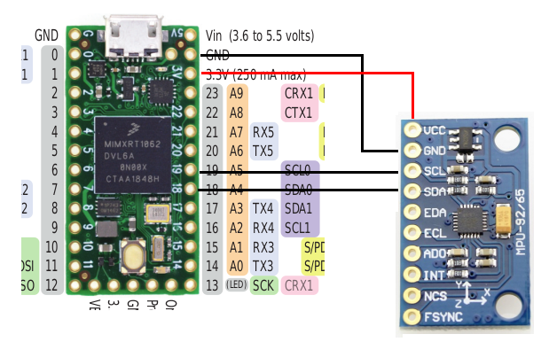
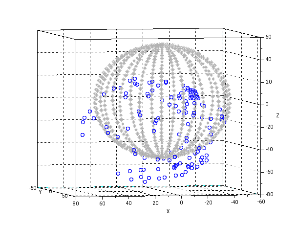
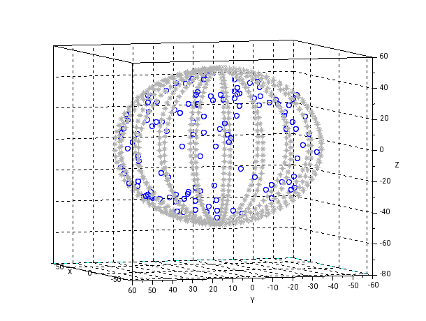
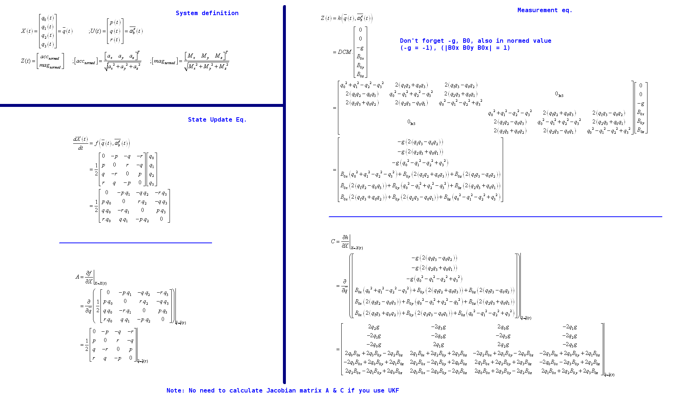

# Kode Teensy 4.0 untuk Extended Kalman Filter & Unscented Kalman Filter

# Hello, it seems you got here from ancient link, please go to [this repo for the latest updated code \(and more description\)!](https://github.com/pronenewbits/Arduino_AHRS_System).

&nbsp;

&nbsp;

&nbsp;

&nbsp;

&nbsp;

Koneksi Teensy 4.0 dengan MPU-9250:

Jangan lupa kalibrasi magnetometer untuk mendapatkan hasil yang terbaik.

Contoh output magnetometer yang belum dikalibrasi:

Setelah dikalibrasi hard-iron:

(TODO: implementasi kalibrasi soft-iron).

Untuk persamaan dinamik sistem IMU bisa dilihat di bawah ini:

